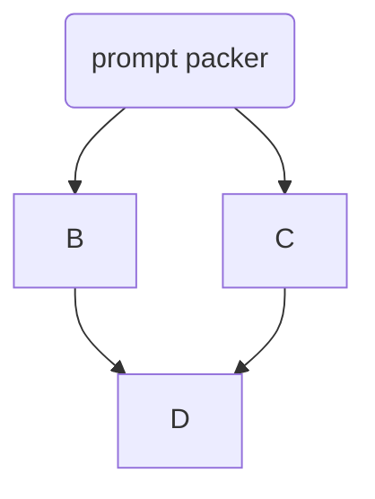

# Survey on ai

#### [Prompt Packer: Deceiving LLMs through Compositional Instruction with Hidden Attacks](papers/prompt_packer.md)

Augmented prompt injection using  __Compositional Instruction Attacks (CIA)__.
Uses an ai model to hide harmful prompt in an harmless one.

#### [Safety Assessment of Chinese Large Language Model](papers/safety_assessment_of_chinese_llms.md)

Safety assessment of ai models.

